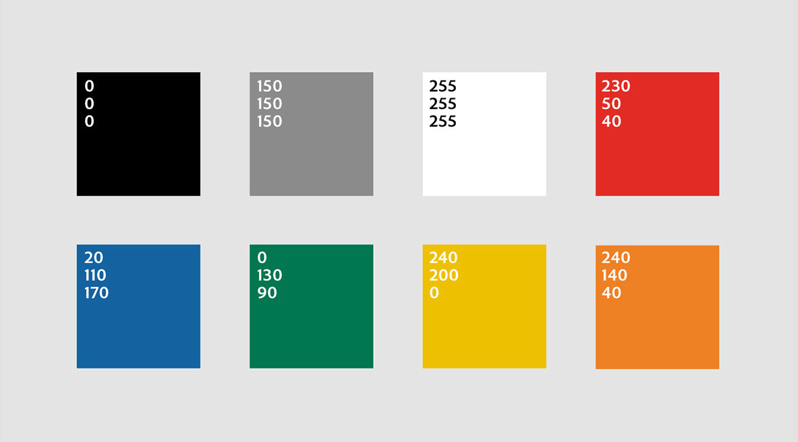
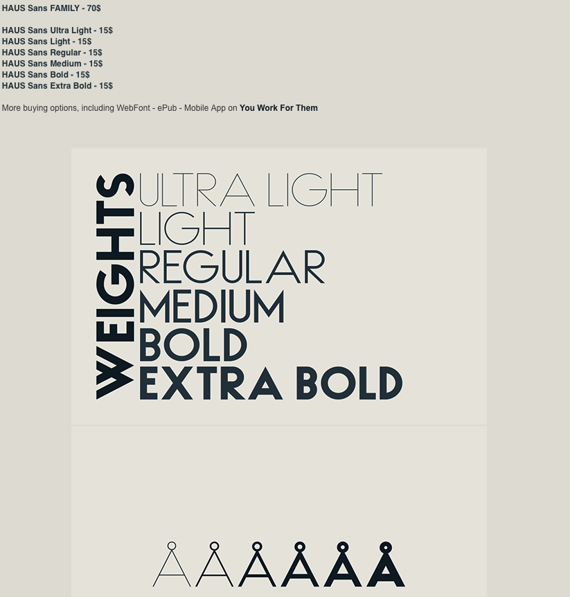

# Mapa de sitio
## PÁGINA ONE PAGE
### HEADER
- Logotipo
- biografías
- Museo
- Galería
### Heroscreen
-imagen acerca del concepto proyecto (ya sea Gif o slider)

### Biografía herbert bayer
- 2 divs o columnas
- imagen del artista y su breve descripción a un lado
### Biografía Lilly Reich
- 2 divs o columnas
- imagen del artista y su breve descripción a un lado
### Video Museo
- video del recorrido del museo
### Galería
- slider con las ilustraciones y fotos del proyecto

<!--  -->
<!--  -->